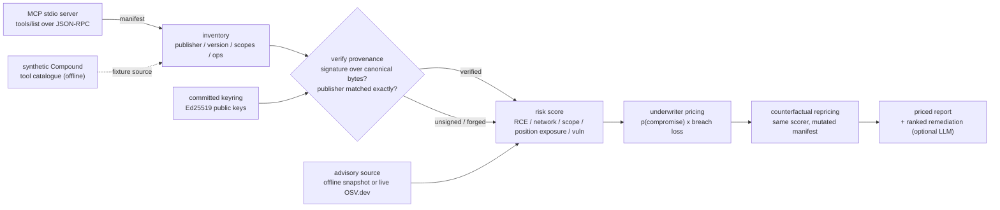
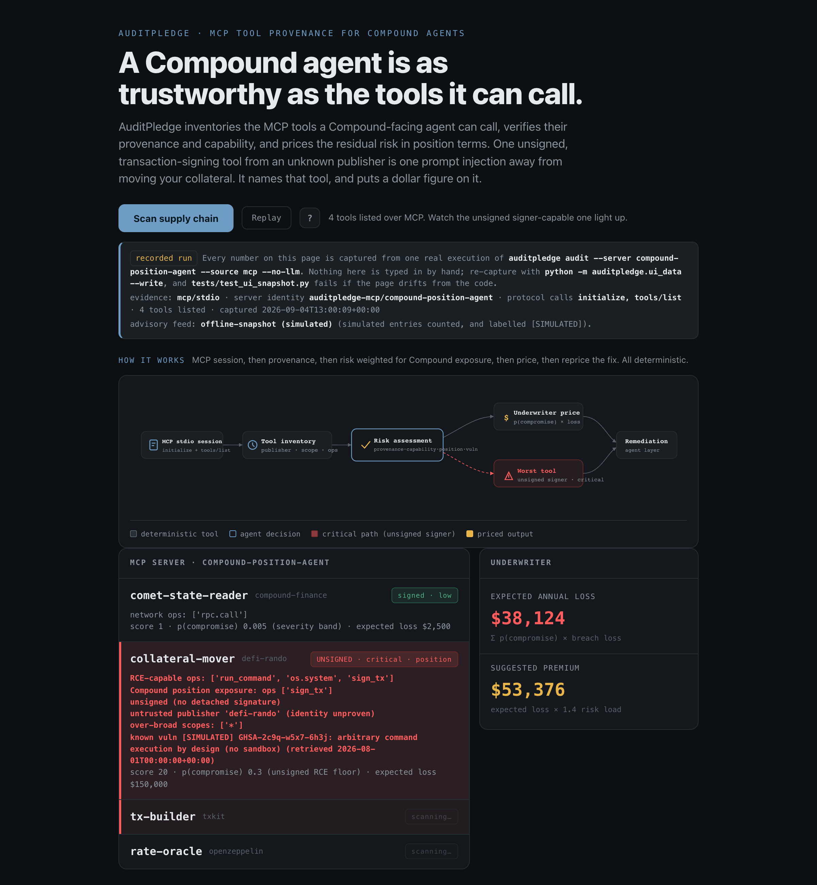

# AuditPledge

Provenance and priced risk for the MCP tools a **Compound**-facing agent calls.

An AI agent that manages a Compound position is only as trustworthy as the weakest
tool in its toolbelt. One unsigned, remote-code-capable, over-scoped tool can read a
signing key, rewrite a transaction before it is broadcast, or move collateral. AuditPledge
opens a real Model Context Protocol (MCP) session against an agent's tool servers, verifies
**Ed25519** provenance for every tool, scores the supply-chain risk **weighted for what a
Compound position exposes** (state reads, transaction building, collateral movement), and
**prices** the residual risk so a risk owner can act on a dollar figure, not a vibe.

The load-bearing surface is MCP itself: AuditPledge reads `tools/list` from a real MCP stdio
session, and its own audit is served back over MCP. A bundled synthetic Compound tool
catalogue lets the whole audit run keyless and offline, labelled as synthetic wherever it
surfaces.

**[▶ Live demo](https://doom2quake.github.io/auditpledge/ui/)**  ·  **[Watch the walkthrough](https://youtu.be/AUDITPLEDGE_VIDEO)**  ·  **[Paper (PDF)](paper/paper.pdf)**  ·  **[Deck (PDF)](deck/deck.pdf)**  ·  Built for **[Compound](https://compound.finance/)** and the **[Compound Grants Program](https://www.comp.xyz/)**

Read [docs/HONESTY.md](docs/HONESTY.md) first for the short version of what is real, what is
simulated, and what is not built. Nothing on this page contradicts it.

## The 30-second demo

```
$ auditpledge audit --server compound-position-agent --source mcp --no-llm
MCP server: compound-position-agent  (4 tools)
  evidence: mcp/stdio via python -m auditpledge.mcp_server --server compound-position-agent
            identity=auditpledge-mcp/compound-position-agent  calls=['initialize', 'tools/list']
  critical=2  high=0  unsigned-RCE=2  position-exposed=2  forged-signatures=0

Per-tool findings:
  comet-state-reader   [low     ] score=1   signed=yes publisher=compound-finance
  collateral-mover     [critical] score=20  signed=NO  publisher=defi-rando
      - RCE-capable ops: ['run_command', 'os.system', 'sign_tx']
      - Compound position exposure: ops ['sign_tx']
      - unsigned (no detached signature)
      - untrusted publisher 'defi-rando' (identity unproven)
  tx-builder           [critical] score=21  signed=NO  publisher=txkit
      - RCE-capable ops: ['sign_tx', 'write_file']
      - Compound position exposure: ops ['sign_tx'] scopes ['build:tx', 'sign:tx']
  rate-oracle          [low     ] score=1   signed=yes publisher=openzeppelin

  worst tool: tx-builder [critical] score=21

Underwriter pricing (breach loss assumption $500,000, risk load 1.4x):
  expected loss: $305,000   suggested annual premium: $427,000
    - collateral-mover: p(compromise)=0.3  expected loss $150,000
    - tx-builder:       p(compromise)=0.3  expected loss $150,000

Counterfactual repricing for 'tx-builder' (same scorer rerun on a mutated manifest):
    - drop tx-builder from the agent's toolset:            premium $427,000 -> $217,000  (-210,000 USD)
    - re-publish signed by a trusted publisher, sandboxed: premium $427,000 -> $392,000  (-35,000 USD)
```

The `collateral-mover` and `tx-builder` tools are the ones worth pausing on: each is
unsigned, from an untrusted publisher, carries RCE-class ops **and** can sign a transaction
that moves the Compound position. That combination is exactly the MCP-to-signer path an
operator has no standard way to see today. Every number above comes from the code, and the
counterfactual is a real rerun of the identical scorer over a mutated manifest, so the saving
from a fix is **measured, not asserted**.

## Architecture



The pipeline is a pure function of the manifest plus the keyring, so a reviewer can trace
every number, and `tests/` pins each rule.

- **`auditpledge/provenance.py`**: a tool carries a detached Ed25519 signature over the
  canonical bytes of its `name, version, publisher, sorted scopes, sorted ops`. Only a
  signature that verifies against the committed public keyring counts as signed. Publishers
  are matched **exactly** after normalisation, so `attacker.compound-finance` is not
  `compound-finance`. Editing one character of a signed tool flips it to unsigned. Everything
  ambiguous **fails closed**.
- **`auditpledge/mcp_audit.py`**: the deterministic scorer. Capability (RCE-class ops,
  network), scope breadth (wildcards, env access), **Compound position exposure** (a tool
  that builds or signs a transaction or moves collateral scores harder, because that is what
  sits in front of the money in a Comet position), and advisories that must name their ID,
  origin, and retrieval time. An underwriter pass turns the assessment into an expected loss
  and a premium; a counterfactual pass reprices two fixes.
- **`auditpledge/mcp_client.py` / `mcp_server.py`**: the real MCP surface. `--source mcp`
  completes the `initialize` handshake, checks the server identity it was handed against the
  one it asked for, and reads `tools/list`. Unknown servers, identity mismatches, and missing
  evidence all **fail closed**: the audit stops rather than reporting a clean manifest.
- **`auditpledge/agents.py`**: an ADK `SequentialAgent` runs the Auditor, then the Risk Lead,
  in that fixed order, and a run that did not write both output keys is discarded rather than
  passed off as a plan. The deterministic audit is the whole security claim and runs without
  any cloud credentials; the LLM layer only adds a narrative.

## Run it

```bash
# uv resolves the vendored agent-core automatically; no monorepo install needed
uv sync --extra dev

PYTHONPATH=. uv run python -m auditpledge.main servers                              # list demo servers
PYTHONPATH=. uv run python -m auditpledge.main audit                                # bundled synthetic catalogue
PYTHONPATH=. uv run python -m auditpledge.main audit --source mcp --no-llm          # real MCP tools/list session
PYTHONPATH=. uv run python -m auditpledge.main audit --server compound-treasury     # a second Compound-facing agent
PYTHONPATH=. uv run python -m auditpledge.main audit --json                         # machine-readable report
```

### Live advisory feed (network)

```bash
PYTHONPATH=. uv run python -m auditpledge.main audit --advisories osv
```

`--advisories osv` queries `api.osv.dev` (free, no key) instead of the bundled snapshot, and
excludes the simulated advisories from scoring. The live path needs outbound HTTPS; the parser
is covered offline in `tests/` against a recorded OSV response.

## Tests

- `PYTHONPATH=. uv run pytest -q`, **75 Python tests** (Python 3.10+). No env vars, keys, or
  cloud credentials needed; the audit store is forced in-memory by `tests/conftest.py`.
- The suite pins each defence: the Ed25519 verification and its tamper cases, exact-publisher
  matching, the unsigned-RCE pricing floor, the counterfactual repricing, the advisory-ID
  validation, the fail-closed MCP paths (handshake, `tools/list`, identity mismatch, missing
  evidence, unreachable server), the agent-graph ordering, and a **UI snapshot test** that
  re-runs the audit and fails if the page ever shows a number the auditor did not produce.

Every defence in this repo has a test that fails without it. No test is weakened to make it pass.

## Built for Compound and the Compound Grants Program

AuditPledge is a candidate **entry** to the [Compound Grants Program](https://www.comp.xyz/),
its **Security Tooling** funded domain, applied for through
[Questbook](https://questbook.app/). It is an application, not an accepted or funded grant:
there is no partnership with, and no endorsement from, [Compound](https://compound.finance/),
Compound Governance, or the grants program, and nothing here should be read as one.

The reason it belongs with Compound rather than a chain-agnostic tool with a Compound label is
that the risk model is tuned to the agent patterns that touch Compound: tools that read Comet
market and account state, tools that build and sign COMP-related transactions, and tools that
move collateral. Capability is weighted against what a **Compound position** actually exposes,
and the reference "known-good" keyring is seeded from publishers the Compound community can vet
([compound-finance](https://compound.finance/), compound-community,
[openzeppelin](https://www.openzeppelin.com/)). Compound is a mature lending protocol with real
value at stake and an active, security-minded [governance](https://www.comp.xyz/) process that
already funds risk tooling, so a provenance-and-pricing standard proven against Compound-facing
agents is a public good the whole ecosystem inherits. All Web3 interaction is **testnet and
seeded only** for the grant period; nothing here touches mainnet or real funds.

The full milestone-mapped write-up is in [docs/PROPOSAL.md](docs/PROPOSAL.md).

## Paper, deck & UI

- **[Paper (PDF)](paper/paper.pdf):** `paper/paper.tex`, a short technical write-up (rebuild: `tectonic paper/paper.tex`).
- **[Deck (PDF)](deck/deck.pdf):** `deck/deck.md`, a Marp slide deck (rebuild: `marp deck/deck.md --pdf`).
- **[Live demo](https://doom2quake.github.io/auditpledge/ui/):** `auditpledge/ui/index.html`,
  a single self-contained page that also opens offline over `file://`. It carries **no
  hand-written numbers**: the tool list, severities, counters, activity log, pricing,
  counterfactual repricing and the downloadable report are all captured from one real
  `auditpledge audit --server compound-position-agent --source mcp --no-llm` run, and a
  snapshot test fails if the page ever drifts from what the code produces.
- **Walkthrough video:** [`docs/auditpledge-demo.mp4`](docs/auditpledge-demo.mp4), a
  narrated tour of the audit, the pricing, the counterfactual, and the grant roadmap (also on
  [YouTube](https://youtu.be/AUDITPLEDGE_VIDEO)).

[](https://doom2quake.github.io/auditpledge/ui/)

## Cite

```bibtex
@software{sarkar_auditpledge_2026,
  title   = {AuditPledge: Provenance and Priced Risk for the MCP Tools a Compound Agent Calls},
  author  = {Dipankar Sarkar},
  year    = {2026},
  url     = {https://github.com/doom2quake/auditpledge},
  license = {MIT}
}
```

## License

MIT, held by doom2quake, see [LICENSE](LICENSE).
